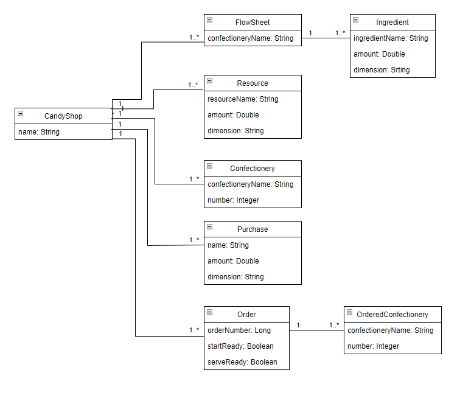

# CandyShop

Релизованы связи сущностей.

- [X] Разработать следующие сущности и атрибуты:

    *	Кондитерская
          *	Список технологических карт
          *	Список компонентов
          *	Список готовых изделий
          *	Список закупок
          *	Список заказов
    *	Технологическая карта
          *	Название изделия
          *	Список компонентов
    *	Компонент
          *	Название (например, мука, яйцо и т.д.)
          *	Количество
          *	Размерность
    *	Заказ
          *	Номер заказа
          *	Список изделий
          *	Признак готовности к выполнению
          *	Признак выполнения

- [ ] Реализовать необходимые экраны просмотра и редактирования для сущностей.

- [ ] Реализовать механизм создания и выполнения заказа.

- [ ] Для приготовления изделия используются ресурсы, имеющиеся в кондитерской. При создании нового изделия работает следующий механизм:
    - [ ] Для изготовления нужно необходимое количество компонентов, указанных в тех. карте.
    - [ ] При создании изделия количество компонентов должно вычитаться из тех, которые имеются в кондитерской.
    - [ ] Если компонентов не хватает – изделия создать нельзя, должно выдаваться сообщение.

- [ ] Для создания заказа используется такой же механизм:  
    - [ ] Признак готовности к выполнению должен выставляться, если нужное количество компонентов доступно в кондитерской.
    - [ ] Признак выполнения заказа выставляется по кнопке, если готовые изделия есть в списке кондитерской.
    - [ ] При нажатии на кнопку готовые изделия должны удаляться из списка готовых. 
